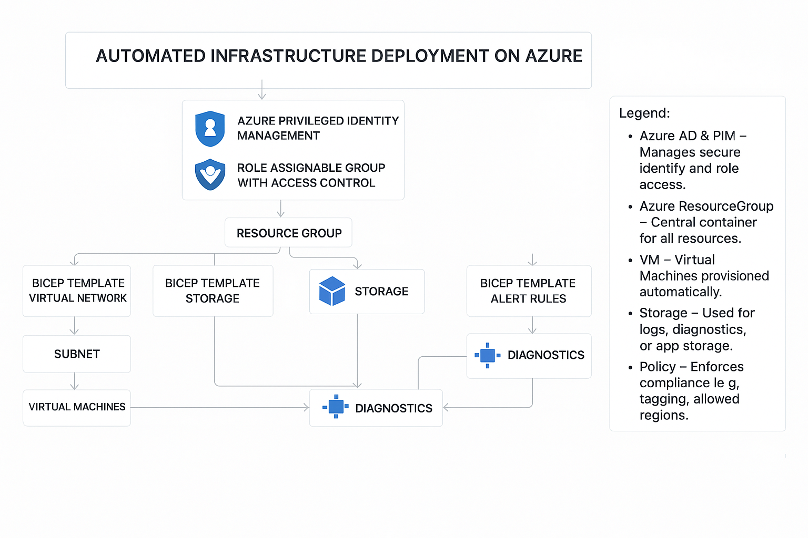

# Azure Infrastructure Using Bicep

Automating Azure Infrastructure Using Bicep (Infrastructure as Code)

## 📖 Project Overview

This project automates Azure infrastructure deployment using Bicep templates and GitHub Actions, ensuring security, scalability, and efficiency across cloud environments. Built as part of the TechStylers Cohort 6.0 Deep Dive Project.

The infrastructure deployment uses Infrastructure as Code (IaC) with Bicep and PowerShell, enabling fast, consistent, and repeatable builds without manual Azure portal interaction.

### Automated Resources

- **Virtual Networks** (VNet) with configurable subnets
- **Network Security Groups** (NSGs) with security rules
- **Network Interface Cards** (NICs)
- **Windows and Linux Virtual Machines** (configurable OS and size)
- **Azure Storage Accounts** with redundancy options
- **Public IP Addresses** for external connectivity

Resources are logically grouped by environment (development, staging, production) to simplify management, enhance security, and support scalability.

### Advanced Features

✅ **Infrastructure-as-Code (IaC)** with Bicep
✅ **GitHub Actions CI/CD** pipeline for automation
✅ **Security & Compliance** with Azure Policy & Defender
✅ **Monitoring & Logging** via Azure Monitor
✅ **Access Control** via Microsoft Entra ID and PIM
✅ **Cost Tracking** with resource tagging
✅ **Modular Templates** for reusability

## 🚀 Quick Start

### Prerequisites

- Azure CLI (version 2.40.0+)
  ```bash
  az bicep install
  ```
- Azure Account with Contributor access
- Git

### Quick Deployment

```bash
# Login to Azure
az login

# Create resource group
az group create --name rg-demo --location eastus

# Deploy infrastructure
az deployment group create \
  --name demo-deployment \
  --resource-group rg-demo \
  --template-file main.bicep \
  --parameters parameters.dev.bicepparam
```

## 📋 Project Structure

```
.
├── main.bicep                 # Main orchestration template
├── modules/
│   ├── networking.bicep       # VNet, Subnets, NSG module
│   ├── compute.bicep          # Virtual Machine module
│   └── storage.bicep          # Storage Account module
├── parameters.dev.bicepparam   # Development environment parameters
├── parameters.prod.bicepparam  # Production environment parameters
├── bicepconfig.json           # Bicep linting configuration
├── .github/workflows/         # GitHub Actions CI/CD
│   └── bicep-validate.yml     # Bicep validation workflow
├── DEPLOYMENT.md              # Detailed deployment guide
├── PARAMETERS.md              # Parameter documentation
├── CONTRIBUTING.md            # Contributor guidelines
├── CHANGELOG.md               # Version history
└── architectural-diagram.png  # Architecture visualization
```

## 📚 Documentation

- **[DEPLOYMENT.md](./DEPLOYMENT.md)** - Step-by-step deployment instructions
- **[PARAMETERS.md](./PARAMETERS.md)** - Complete parameter reference
- **[CONTRIBUTING.md](./CONTRIBUTING.md)** - How to contribute to this project

## 🏗️ Architecture



### Components

1. **Networking Tier**
   - Virtual Network with configurable address space
   - Subnets for logical segregation
   - Network Security Groups for traffic control

2. **Compute Tier**
   - Virtual Machines with Windows/Linux OS
   - Configurable VM sizes and SKUs
   - Secure credential management

3. **Storage Tier**
   - Storage Accounts with redundancy options
   - Secure HTTPS-only connectivity
   - Cost-effective data storage

4. **Management Tier**
   - Azure Policy enforcement
   - Role-based access control
   - Monitoring and alerting

## 🔧 Configuration

### Parameters Files

Each environment has its own parameter file:

```bash
# Development environment
parameters.dev.bicepparam

# Production environment
parameters.prod.bicepparam
```

Edit these files to customize:
- Resource names
- Azure regions
- VM sizes and OS versions
- Security rules
- Tags and metadata

### Security Considerations

- ⚠️ **Never commit passwords** - Use Azure Key Vault or GitHub Secrets
- Use **Network Security Groups** to restrict inbound traffic
- Enable **Microsoft Defender for Cloud** for threat monitoring
- Implement **Azure Policy** for compliance
- Use **managed identities** for secure authentication

## 🚢 Deployment Workflows

### GitHub Actions

The repository includes automated CI/CD workflows:

```yaml
# On every push and pull request to main:
- Bicep syntax validation
- Linting checks
- Security scanning
- Parameter validation
```

View workflow: [.github/workflows/bicep-validate.yml](./.github/workflows/bicep-validate.yml)

## 📊 Monitoring & Management

- **Azure Monitor** - Real-time performance tracking
- **Log Analytics** - Centralized logging
- **Cost Management** - Track spending by resource tags
- **Azure Policy** - Enforce compliance standards

## 🔄 Updating Deployments

To update existing resources:

```bash
az deployment group create \
  --name deployment-update \
  --resource-group rg-demo \
  --template-file main.bicep \
  --parameters parameters.dev.bicepparam
```

Bicep intelligently updates only changed resources.

## 🗑️ Cleanup

Delete all resources:

```bash
az group delete --name rg-demo --yes --no-wait
```

## 🐛 Troubleshooting

### Validate Templates Before Deployment

```bash
# Lint your Bicep files
az bicep lint main.bicep --strict

# Build to check for errors
az bicep build main.bicep
```

### Common Issues

**Issue**: "The subscription could not be found"
```bash
# Solution: Login and select subscription
az login
az account set --subscription "<subscription-id>"
```

**Issue**: "Resource name already exists"
```bash
# Solution: Use unique resource names (especially for storage accounts)
```

**Issue**: "Insufficient permissions"
```bash
# Solution: Ensure your account has Contributor role
az role assignment list --assignee "<email>"
```

See [DEPLOYMENT.md](./DEPLOYMENT.md) for more troubleshooting tips.

## 🤝 Contributing

Contributions are welcome! Please see [CONTRIBUTING.md](./CONTRIBUTING.md) for guidelines on:
- Code standards
- Commit conventions
- Pull request process
- Testing requirements

## 📝 Version History

See [CHANGELOG.md](./CHANGELOG.md) for version history and release notes.

## 📚 Resources

- [Azure Bicep Documentation](https://learn.microsoft.com/en-us/azure/azure-resource-manager/bicep/overview)
- [Azure CLI Reference](https://learn.microsoft.com/en-us/cli/azure/)
- [Azure Best Practices](https://learn.microsoft.com/en-us/azure/cloud-adoption-framework/ready/azure-best-practices/)
- [Infrastructure as Code Best Practices](https://learn.microsoft.com/en-us/devops/deliver/what-is-infrastructure-as-code)

## 👥 Authors

- Built as part of TechStylers Cohort 6.0

## 📄 License

This project is open source and available under the MIT License.

---

**Last Updated**: 2026-03-28
**Bicep Version**: 0.13.1+
**Azure CLI Version**: 2.40.0+